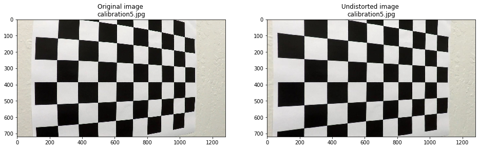
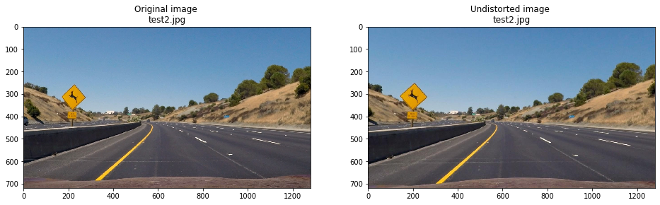
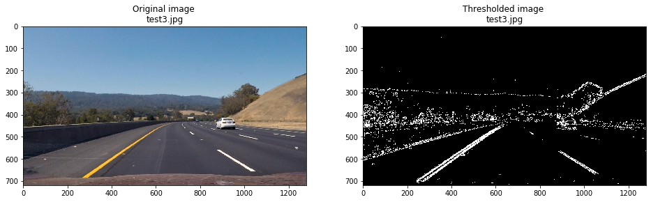
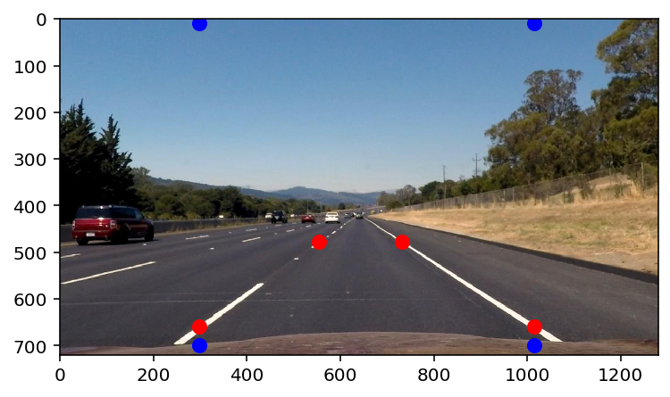
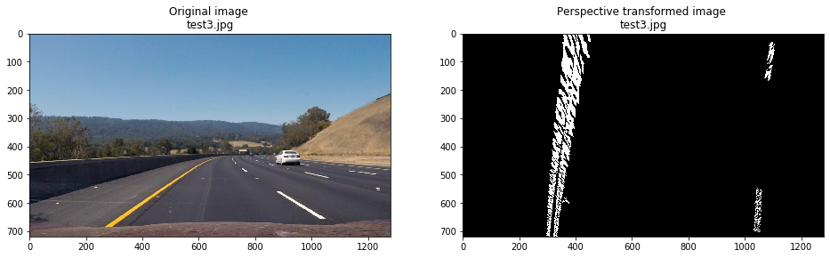
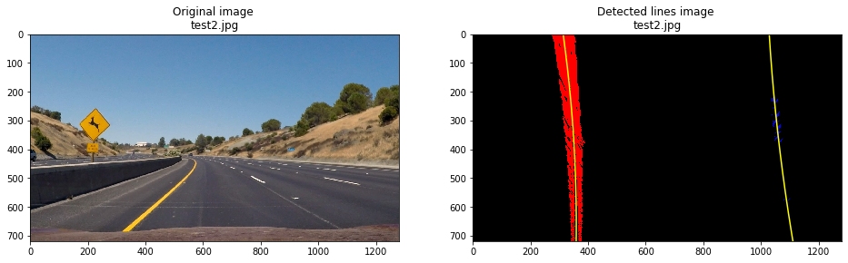
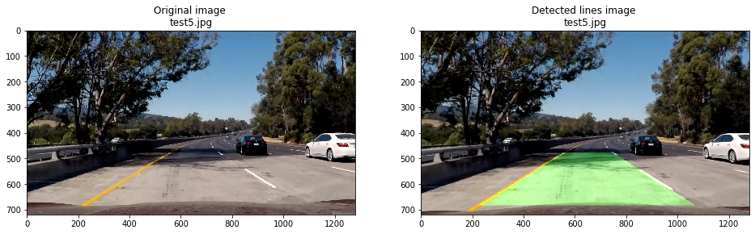

# Advanced Lane Finding Project Writeup

The goals / steps of this project are the following:

* Compute the camera calibration matrix and distortion coefficients given a set of chessboard images.
* Apply a distortion correction to raw images.
* Use color transforms, gradients, etc., to create a thresholded binary image.
* Apply a perspective transform to rectify binary image ("birds-eye view").
* Detect lane pixels and fit to find the lane boundary.
* Determine the curvature of the lane and vehicle position with respect to center.
* Warp the detected lane boundaries back onto the original image.
* Output visual display of the lane boundaries and numerical estimation of lane curvature and vehicle position.

**The code for this project is in this [Jupyter Notebook](https://github.com/tongwang01/CarND-Advanced-Lane-Lines/blob/master/Tong%20solution.ipynb).**

## [Rubric](https://review.udacity.com/#!/rubrics/571/view) Points

Here I will consider the rubric points individually and describe how I addressed each point in my implementation.  

---

## Camera Calibration

### Briefly state how you computed the camera matrix and distortion coefficients. Provide an example of a distortion corrected calibration image.

The code for this step is the functions `calibrate_camera()` and `undistort()` in the [notebook](https://github.com/tongwang01/CarND-Advanced-Lane-Lines/blob/master/Tong%20solution.ipynb).

I used `cv2.findChessboardCorners()` to find corners in the chessboards images, and set them as the image points. I set the object points to be regular 9 x 6 arrays on the z = 0 plane. I then used `cv2.calibrateCamera()` to calibrate the camera and get the camera matrix and distortion coefficients. I then used `cv2.undistort()` to generate undistorted images.

Example:

## Pipeline (single images)

### Provide an example of a distortion-corrected image.

Example:

### Describe how (and identify where in your code) you used color transforms, gradients or other methods to create a thresholded binary image.  Provide an example of a binary image result.

The code for this step is the function `gradient_and_color_threshold()` in the notebook.

I used a combination of:
* Magnitude of gradient threshold
* Direction of gradient threshold
* Color threshold (on the S channel)
to generate a binary thresholded image.

Example:

### Describe how (and identify where in your code) you performed a perspective transform and provide an example of a transformed image.

The code for this step is the function `perspective_transform()` and its preceeding code block in the notebook.

I manually picked four points on a test image with straight lane lines as the source points, and four destination points. I tuned the selection by eyeballing the results:

I then used the `cv2.warpPerspective()` function to perform the perspective transform.

Example:

### Describe how (and identify where in your code) you identified lane-line pixels and fit their positions with a polynomial?

The code for this step is the functions `find_lane_pixels()` and `fit_polynomial()` in the notebook.

I used the sliding windown technique introduced in the lectures, and then fitted a 2nd order polynomial to the activated pixels. 

Example:

### Describe how (and identify where in your code) you calculated the radius of curvature of the lane and the position of the vehicle with respect to center.

The code for this step is the function `measure_curvature_real()` in the notebook.

I set the pixel/meter conversion rate by looking at the number of pixels that lane lines occupy in the image space.

### Provide an example image of your result plotted back down onto the road such that the lane area is identified clearly.

Example:

---

## Pipeline (video)

### Provide a link to your final video output.  Your pipeline should perform reasonably well on the entire project video (wobbly lines are ok but no catastrophic failures that would cause the car to drive off the road!).

I stringed the pipeline together into one main function `detect_lane_in_image()` and applied it on the test videos.

Here's [my video result for project_video](https://github.com/tongwang01/CarND-Advanced-Lane-Lines/blob/master/video_output/project_video_output.mp4)

Here's [my video result for harder_challenge_video](https://github.com/tongwang01/CarND-Advanced-Lane-Lines/blob/master/video_output/harder_challenge_video_output.mp4)

---

## Discussion

### Briefly discuss any problems / issues you faced in your implementation of this project.  Where will your pipeline likely fail?  What could you do to make it more robust?

On the project video the pipeline performed well overall. The only major problem that I noticed is that the detected lanes are occasionally wobbly. Applying smoothing over ajacent frames in the video stream may solve this issue.

On the harder challenge video the wobbly phenomenon is more pronuanced. I suspect one big reason is that all the parameters in my pipeline is tuned (manually) based on the set of test_images, which are more similar to project video (maybe they are frames in the project video?) but less so to the harder challenge video. In this sense we might have "overfitted" to the test images. Speficially:
* The manually set perspective transform is clearly off for the harder challenge video when it comes to sharp turns.
* My lane detection is sometimes "distracted" as it where by oncoming cars - which were not present in the test images. 
* Much more drastic changes of lighting conditions also caused my lane detection to fail.

